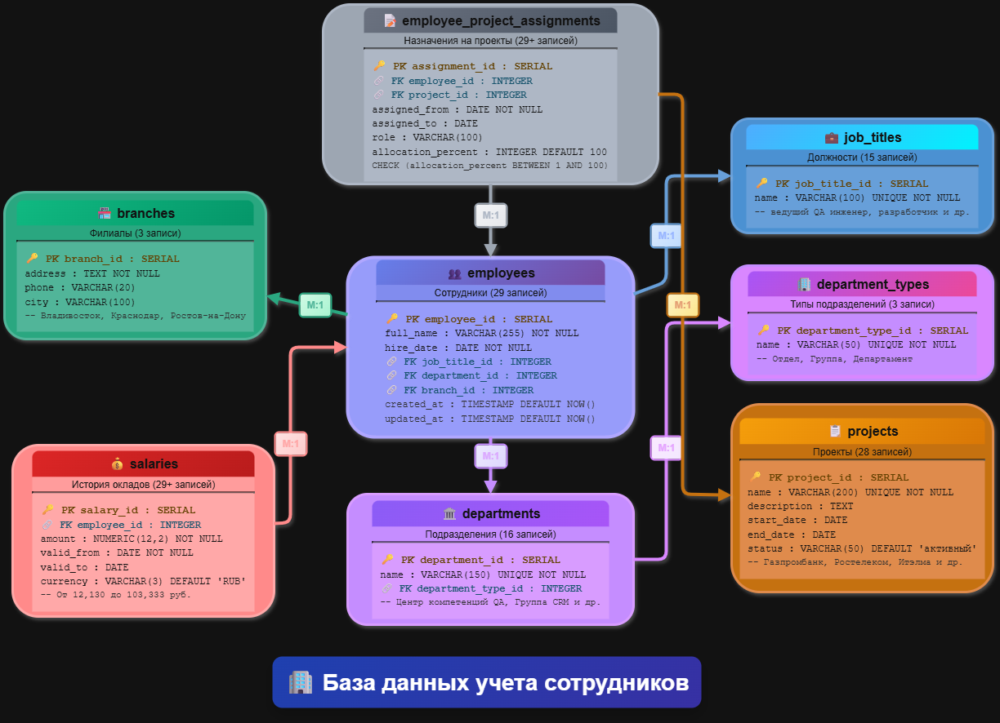

# Домашнее задание к занятию «Базы данных»

### Задание 1

Опишите не менее семи таблиц, из которых состоит база данных. Определите:

- какие данные хранятся в этих таблицах,
- какой тип данных у столбцов в этих таблицах, если данные хранятся в PostgreSQL.

Начертите схему полученной модели данных. Можете использовать онлайн-редактор: https://app.diagrams.net/

Этапы реализации:
1.	Внимательно изучите предоставленный вам файл с данными и подумайте, как можно сгруппировать данные по смыслу.
2.	Разбейте исходный файл на несколько таблиц и определите список столбцов в каждой из них. 
3.	Для каждого столбца подберите подходящий тип данных из PostgreSQL. 
4.	Для каждой таблицы определите первичный ключ (PRIMARY KEY).
5.	Определите типы связей между таблицами. 
6.	Начертите схему модели данных.
На схеме должны быть чётко отображены:
   - все таблицы с их названиями,
   - все столбцы  с указанием типов данных,
   - первичные ключи (они должны быть явно выделены),
   - линии, показывающие связи между таблицами.

**Результатом выполнения задания** должен стать скриншот получившейся схемы базы данных.

### Ответ:

---

## Заключение

В ходе выполнения домашнего задания была спроектирована нормализованная реляционная база данных на основе анализа реальных данных о сотрудниках. Создана профессиональная ER-диаграмма, полностью соответствующая требованиям задания.

Основные достижения:
✅ Проанализирован Excel файл с данными 29 сотрудников
✅ Спроектировано 8 таблиц с правильной нормализацией данных
✅ Определены корректные типы данных PostgreSQL для всех полей
✅ Выделены первичные ключи (PK) и внешние ключи (FK)
✅ Установлены связи типа Many-to-One (M:1) между таблицами
✅ Создана визуальная ER-диаграмма в draw.io с красивым оформлением
✅ Добавлены ограничения целостности и дополнительные поля для практического использования
✅ Схема готова для реализации в PostgreSQL и импорта реальных данных

Полученная модель данных обеспечивает эффективное хранение информации о сотрудниках, их должностях, подразделениях, зарплатах и проектных назначениях с соблюдением принципов реляционного проектирования.